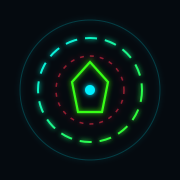

<!--
  Profile README · cyb3rvolt3x-A4lixhaS3ntin3l
  Aesthetic: tactical cyber / sentinel · green-cyan-crimson on void
  Assets: /assets/*.svg  ·  No secrets in this repo
-->

<div align="center">

  

  <br/>

  <a href="https://git.io/typing-svg">
    
  </a>

  <br/>

  <a href="https://andraxpenteste.in">
    
  </a>
  <a href="mailto:andraxpentester@gmail.com">
    
  </a>
  <a href="https://github.com/A4lixhaS3ntin3l">
    
  </a>
  
  

  <br/><br/>

  

</div>

---

```
╔══════════════════════════════════════════════════════════════════════════╗
║  NODE      ::  cyb3rvolt3x-A4lixhaS3ntin3l                               ║
║  CALLSIGN  ::  cyb3rvolt3x  /  S3ntinel                                  ║
║  OPERATOR  ::  Syed zada abrar                                           ║
║  CLASS     ::  Full-stack Developer  ×  Certified Penetration Tester     ║
║  SIGNAL    ::  https://andraxpenteste.in                                 ║
║  UPLINK    ::  andraxpentester@gmail.com                                 ║
║  EPOCH     ::  2026                                                      ║
╚══════════════════════════════════════════════════════════════════════════╝
```

<div align="center">
  
</div>

---

## ▌ WHO I AM

I'm **Syed zada abrar** (`cyb3rvolt3x-A4lixhaS3ntin3l`) — a full-stack builder who also thinks like an attacker.

I ship web platforms end-to-end and pressure-test them the way real adversaries would. Stack depth on one side, ethics and defense on the other. Company orbit: **[@A4lixhaS3ntin3l](https://github.com/A4lixhaS3ntin3l)**. Public channel: **[andraxpenteste.in](https://andraxpenteste.in)**.

| | |
|:--|:--|
| **Alias** | `cyb3rvolt3x` · Sentinel identity |
| **Roles** | Full-stack engineer · Certified penetration tester · Platform architect |
| **Mode** | `#hireable` — available for builds, audits, and hard problems |
| **Comms** | [andraxpentester@gmail.com](mailto:andraxpentester@gmail.com) |
| **Since** | GitHub node online since **2022** |

<div align="center">
  
</div>

## ▌ WHAT I BUILD

```text
┌─ forge ─────────────────────────────────────────────────────────────┐
│  [01] Full-stack product systems (PHP · JS · Python · modern admin) │
│  [02] Security toolkits, OSINT-flavored automation, defensive util  │
│  [03] Next-gen CMS / studio admin R&D  (private company tree)       │
│  [04] Hardened web experiences that survive real red-team thinking  │
└─────────────────────────────────────────────────────────────────────┘
```

**Private R&D (not cloneable — by design):**  
Currently forging a **next-generation CMS / full-stack platform stack** under closed company development (Studio admin, platform core, modules, docs). Public profile guests only see the mission — the source stays on lockdown.

<div align="center">
  
</div>

## ▌ FEATURED PUBLIC WORK

> Only **public** repositories are linked below. Private trees are intentionally omitted.

| Unit | Focus | Link |
|:-----|:------|:-----|
| **SentinelReignweb** | JS surface of the Sentinel orbit | [open](https://github.com/cyb3rvolt3x-A4lixhaS3ntin3l/SentinelReignweb) |
| **SentinelReign** | Python-side Sentinel experiments | [open](https://github.com/cyb3rvolt3x-A4lixhaS3ntin3l/SentinelReign) |
| **Sentinelgeneratepress** | PHP / theme integration lane | [open](https://github.com/cyb3rvolt3x-A4lixhaS3ntin3l/Sentinelgeneratepress) |
| **ShadowsEye** | Python sensor / security-oriented tooling | [open](https://github.com/cyb3rvolt3x-A4lixhaS3ntin3l/ShadowsEye) |
| **SpectorSec** | Security-focused Python utilities | [open](https://github.com/cyb3rvolt3x-A4lixhaS3ntin3l/SpectorSec) |
| **rANSOMEWARE-REMOVER** | Recovery-oriented utility (public stars) | [open](https://github.com/cyb3rvolt3x-A4lixhaS3ntin3l/rANSOMEWARE-REMOVER) |
| **syedabrar-andraxcam** | Modified camera-awareness experiment | [open](https://github.com/cyb3rvolt3x-A4lixhaS3ntin3l/syedabrar-andraxcam) |

<details>
<summary><b>// quick-nav menu (interactive-feeling index)</b></summary>

```
[ 1 ]  WEBSITE     →  https://andraxpenteste.in
[ 2 ]  MAIL        →  andraxpentester@gmail.com
[ 3 ]  ORG         →  https://github.com/A4lixhaS3ntin3l
[ 4 ]  PROFILE     →  https://github.com/cyb3rvolt3x-A4lixhaS3ntin3l
[ 5 ]  REPOS       →  https://github.com/cyb3rvolt3x-A4lixhaS3ntin3l?tab=repositories
[ 6 ]  HIRE        →  open · state = true
```

</details>

<div align="center">
  
</div>

## ▌ STACK / ARSENAL

<p align="center">
  
</p>

<p align="center">
  
  
  
  
  
  
  
  
  
  
</p>

```
 SKILLS MATRIX                                                    LEVEL
 ──────────────────────────────────────────────────────────────────────
 full-stack web / CMS platforms        ██████████████████████░░░░  high
 offensive security / ethical PT       ████████████████████░░░░░░  high
 Python automation & tooling           ███████████████████░░░░░░░  high
 JS / admin UIs / product fronts       ██████████████████░░░░░░░░  solid
 Linux ops · bash · hardening habits   ████████████████████░░░░░░  high
```

<div align="center">
  
</div>

## ▌ COMBAT METRICS

<p align="center">
  
  
</p>

<p align="center">
  
  
</p>

<p align="center">
  
</p>


<div align="center">
  
</div>

## ▌ CURRENT FOCUS — 2026

```bash
# operator priority queue
queue = [
  "next-gen CMS platform forge  (private R&D)",
  "full-stack product surfaces + studio admin UX",
  "ethical offense → better defaults on every ship",
  "public security tooling when it strengthens the mission",
]
while queue:
    ship_or_harden(queue.pop(0))
```

| Channel | Signal |
|:--------|:-------|
| **Build** | Platform architecture, CMS-class systems, JS/PHP product stacks |
| **Break** | Authorized pentest mindset, tool-assisted recon, blue-team feedback loops |
| **Broadcast** | [andraxpenteste.in](https://andraxpenteste.in) |
| **Available** | Open for hire — serious product & security work |

---

## ▌ CONNECT

```
  ┌──────────────────────────────────────────────────────────┐
  │  > initiate handshake                                    │
  │                                                          │
  │  mail     andraxpentester@gmail.com                      │
  │  web      https://andraxpenteste.in                      │
  │  github   https://github.com/cyb3rvolt3x-A4lixhaS3ntin3l │
  │  org      @A4lixhaS3ntin3l                                │
  └──────────────────────────────────────────────────────────┘
```

<p align="center">
  <a href="mailto:andraxpentester@gmail.com"></a>
  <a href="https://andraxpenteste.in"></a>
  <a href="https://github.com/cyb3rvolt3x-A4lixhaS3ntin3l?tab=repositories"></a>
</p>

---

<div align="center">

```
// end of transmission · 2026 · cyb3rvolt3x-A4lixhaS3ntin3l
// build · break · fortify · repeat
```


<sub>Profile surface rendered from public GitHub markdown + local SVG assets. Private product trees stay silent.</sub>

</div>
